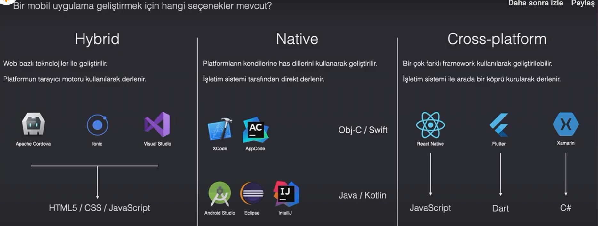
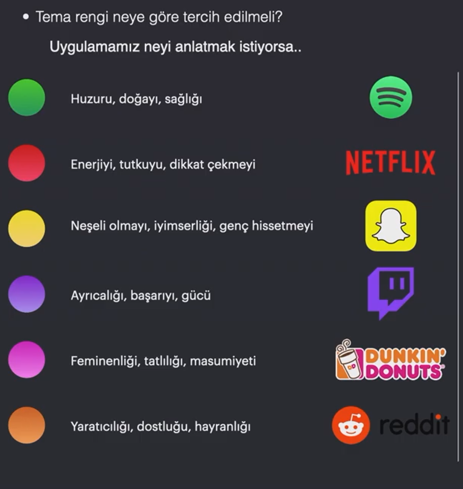
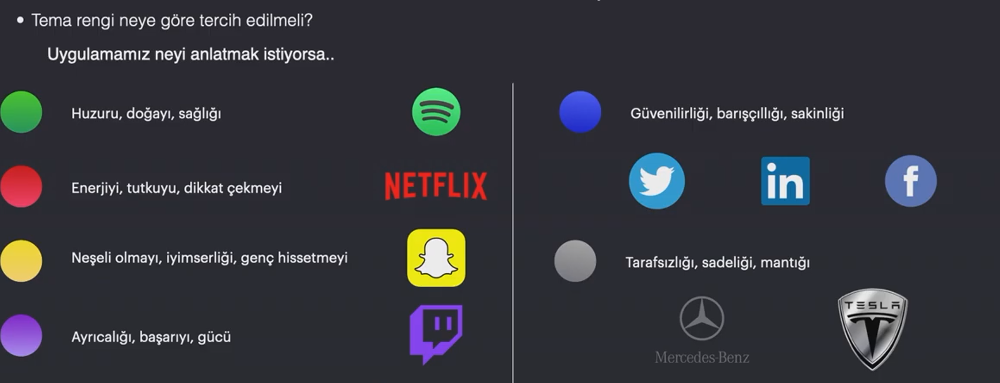
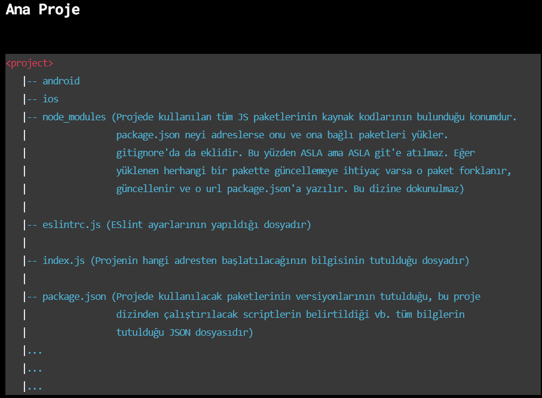

# Start
## react-native

***
- topluluk destekleri olan programlar 
- hem android hem ios üzerinde uygulama geliştirilebilir.
- işletim sisteminin kaynaklarını hybrid platformlara göre daha iyi kullanır.
- native uygulamara kıyasla performans kaybı olur zamanla sorunlar azalıyor.
- bazı paketlerin topluluk desteği kesilebiliyor.
## flutter
- google tarafından destekleniyor
- yeni bir alan ve dil
- dart js kadar kolay ve kullanışlı dil değil.
## xamarin
- microsoft tarafından desteklenen bir dil.
- diğerlerine göre kıyasla çok sevilen bir platform değil
- c# ile geliştiriliyor.

## Nasıl bir uygulama geliştirmeliyim?

## Nasıl bir kitle?

## Uygulama arayüzü nasıl olmalı?
- Kullanıcılar tarafından feedback ile tasarım değiştirilebilir.

### User Interface(UI)
- Uygulamanın görünüşünü baz alan tasarım biçimidir.
- Uygulamın "nasıl göründüğü" ile ilgilenir.
### User Experience(UX)
- Uygulamanın kullanılabilirliği baz alan tasarım biçimidir.
- Uygulamın "nasıl hissettirdiği" ile ilgilenir.
- Tasarım aşamasında her daim Ux önemlidir.

## Uygulamanın Tema rengi nasıl olmalı?
- amacımız ne ise o renk kullanılmalı
- 
- 

## Ne yapılmamalı ?
- 
## Ornek tasarımlar
- 
- 

## Yararlı VSCode Eklentileri
### Geliştirme sürecinde kolaylık sağlayabilecek eklentiler listesi

- React Native Tools
- React Native Snippet
- ES7 React/Redux/GraphQL/React-Native snippets
- ESLint
- Prettier
- Visual Studio IntelliCode
- Tabnine Autocomplete AI
- GitLens
- Bracket Pair Colorizer
- Auto Close Tag
- Auto Rename Tag
- Version Lens
- Todo Tree
- Conventional Commits

## Ana Proje

