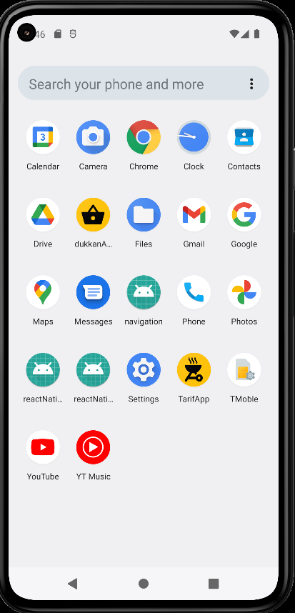
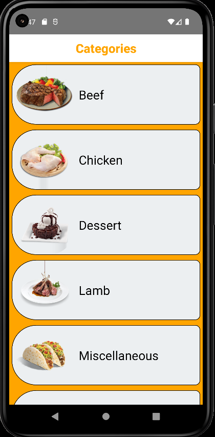
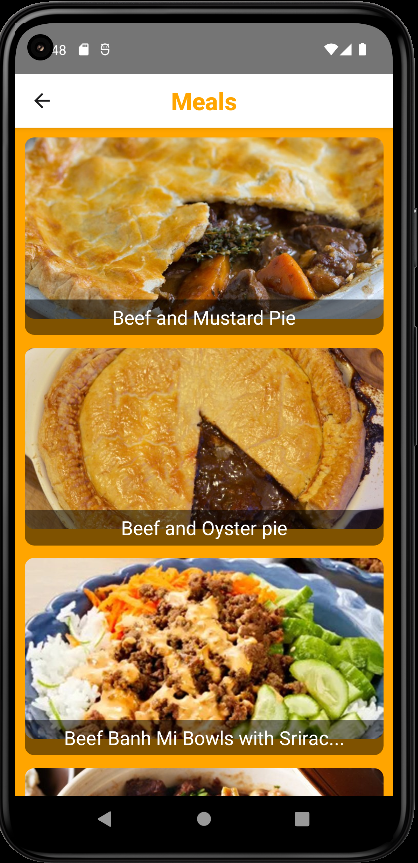
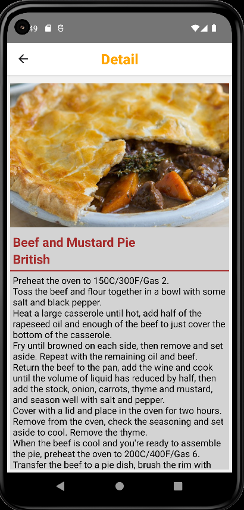
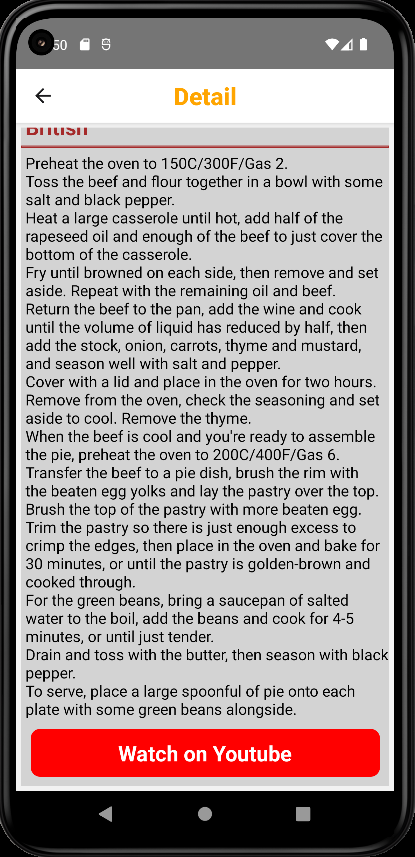

# Project Name : reactNative_06_Tarifka
## Project Images and Gifs

## Used packages
- [lottie-react-native](https://www.npmjs.com/package/lottie-react-native)
- [axios](https://www.npmjs.com/package/axios/v/0.26.0)
- [React Navigation](https://reactnavigation.org/docs/getting-started/)
- [App Icon Changed](https://romannurik.github.io/AndroidAssetStudio/index.html)
- [Config for hidden URL in .env file](https://www.npmjs.com/package/react-native-config)

<!-- In my case I have been able to avoid this error by running the app resetting the cache: npm start --reset-cache -->
## What Used ?

- stack navigation for routing pages in app
- config package for hidden url
- [Linking api](https://reactnative.dev/docs/linking) openURL attr. for open youtube url in detail page
- Alert.alert for empty youtube url video
- Navigation.navigate for direction between pages and used route.params 
- useFetch custom hook data fetching from API
- without state management system such as redux, contex api etc. 

## Used components
- Flatlist
- TouchableWithoutFeedback
- TouchableOpacity
- Image
- ScrollView
- View, Text
