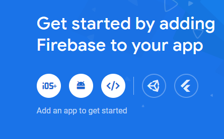
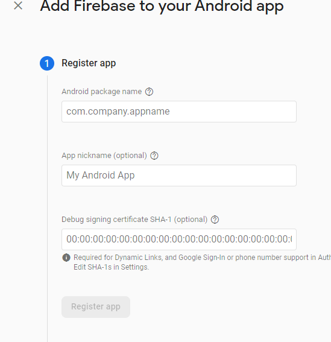
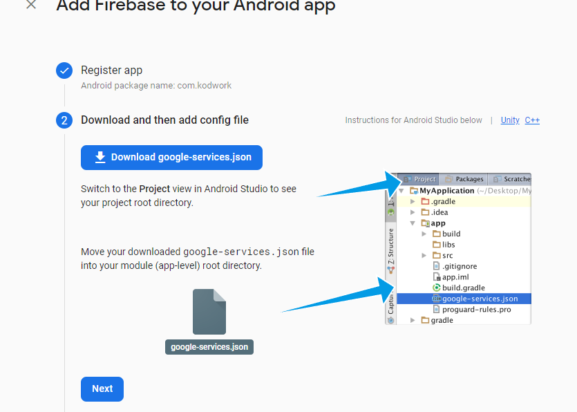
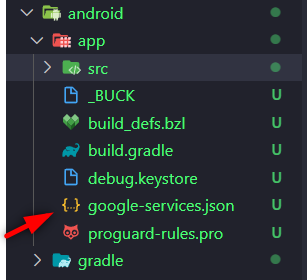
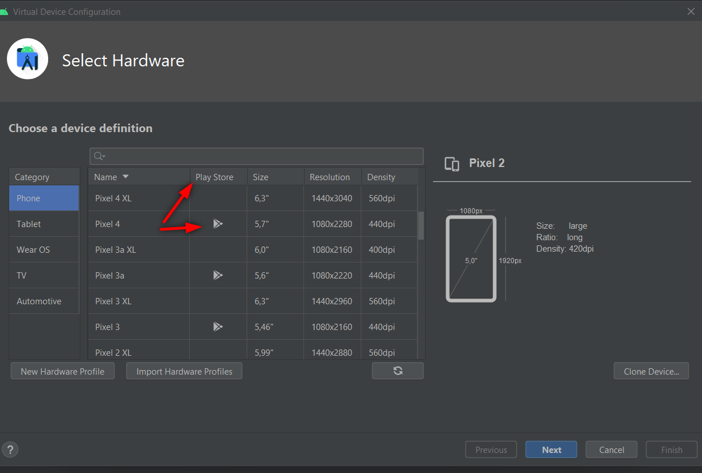

# Project Name : kodwork

## Firebase section

- öcelikle bir hesap olmadı, yoksa [google account](https://www.google.com/intl/tr/gmail/about/)
- firebase dökümantasyon kısmına git ve get started tıkla [firebase start documentation](https://firebase.google.com/)
- "Add project" tıkla "Enter your project name" input alanına proje ismini yaz
- "Google analytics for your Firebase project" bölümünde aşağıda yer alan enable ile başlayan butonu kapat analitik gerek yok şimdilik
- "continue" butonuna tıka ve bekle çok az zaman alır.
-  burada andorid iconuna tıkla
   "android package name" kısmına proje dosyamızda yer alan
  ...project_name\android\app\src\main\AndroidManifest.xml package karşılığına yer alan ismi yaz örnek= "com.kodwork"
- diğer kısımlar için şimdilik bir işlem yapmayacağım için "Register app" butonuna tıklıyoruz
-  buradaki json dosyasını indir ve işaret edilen yere yapıştır.
- 
- google servislerinin aktif edilmesi gerektiği için iki dosyada modifiye etmemiz gereklidir.
     - ilki, /android/build.gradle altına git ve depemdecies kısmına şu kısmı(classpath ile başlayan yer) ekle
        ```
        buildscript {
        dependencies {
        // ... other dependencies
        classpath 'com.google.gms:google-services:4.3.14'
        // Add me --- /\
        }
        }
        ```
    - ikinci olarak /android/app/build.gradle dosyasına git ve en yukarıdaki kısma şunu yapıştır.

        ```
        apply plugin: 'com.android.application' //! bu zaten var olan kısım
        apply plugin: 'com.google.gms.google-services' // <- Add this line
        ```

- fireabase sitesinde next diyoruz orda yapılması gerekenleri yukarıdaki gibi anlatmış zaten tekrar next diyerek fireabse ayarlamaları tarafı bitiyor.

- terminale gidip proje dosya dizininde olduğunuzdan emin olacak şekilde `npx react-native run-android` diyoruz ve emülatörümüz çalışıyor.
  - emülatör kısmı için android studio da play store olab bir sanal cihaz tanımlamalısınız aksi takdirde sıkıntı çıkabiliriz. 
