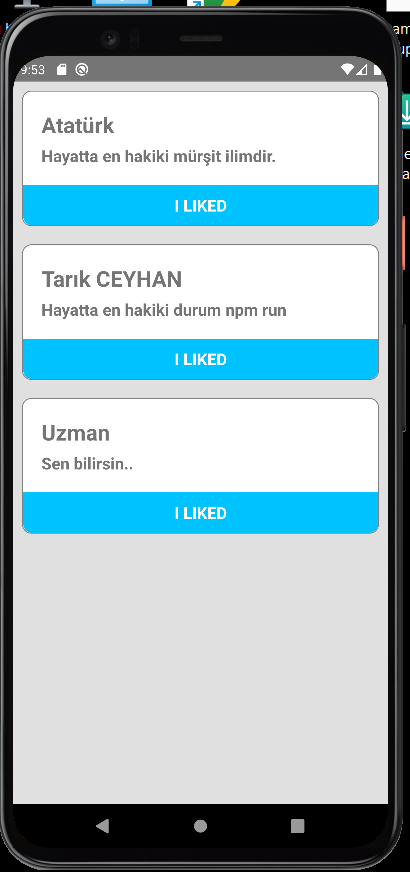
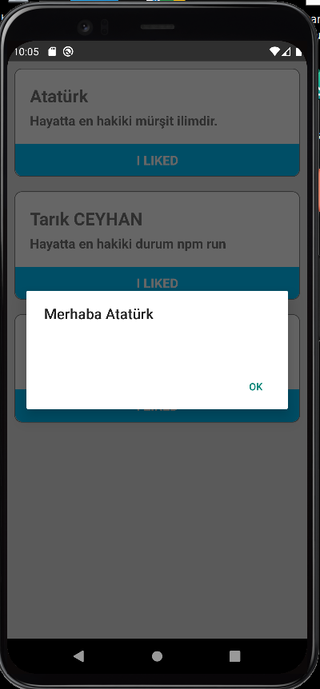

# My first react-native project

********************************

- 

## Which used skills?

- react-native properties used | View, SafeAreaView, Text, TouchableOpacity etc.
- #### action | onPress used with Alert.
 
- custom component properties
- props parent to child components
- styles using StyleSheet.create
- css | flex, flex-direction, color, borderWidth, borderRadius, padding etc.

[Project Video](https://github.com/tceyhan/react-native/issues/1#issue-1395407451)
