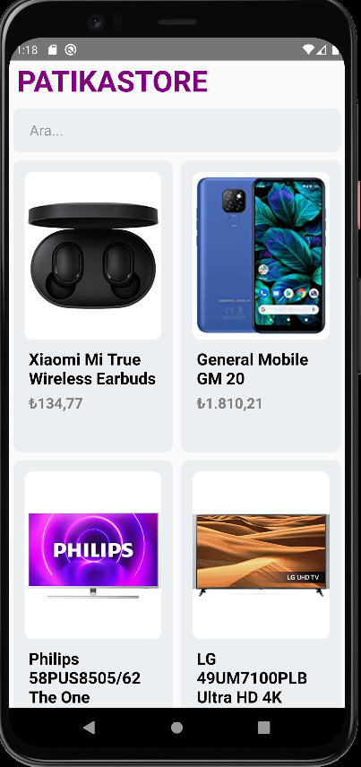

# Project Name : reactNative_02_patikaStore 

## Which use React Native component
1. TextInput for SearchBar 
2. Image for Product images
3. FlatList for products list
3. Text and View already default in any project

## Styles used other than standard styles

- Dimensions =>  product image height [Click for  Dimensions features](https://reactnative.dev/docs/dimensions)
- resizeMode 'contain' => Methods to fit product images [Click for  resizeMode features](https://reactnative.dev/docs/image-style-props#resizemode)
- textTransform  =>  product in_stock option text field [Click for  textTransform features](https://reactnative.dev/docs/text-style-props#texttransform)

- [www.patika.dev ](www.patika.dev)