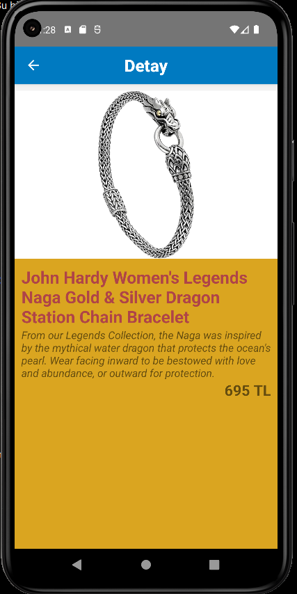

# Project Name : reactNative_05_dukkanApp
## Projects Gifs


## Project Images


## [Project Video Link](https://github.com/tceyhan/react-native-all/issues/1#issue-1428227837)
## Used skills
- Custom hooks created named useFetch
- useState, useEffect
- fetch data from API with *axios*
- *ActivityIndicator* for loading while data fetching, and then used [lottie animation package](https://lottiefiles.com/search?q=loading&category=animations&type=free) used
- destructred method for styles objects

## Used styles and component
- FlatList component
- resizeMode used in Image component
- [lottie package for animation](https://www.npmjs.com/package/lottie-react-native)
- headerTintColor, headerStyle,headerTitleStyle,headerTitleAlign properties used in Stack.Screen options object

### project start and required Settings

1. npx react-native init dukkanApp
2. cd dukkanApp
3. open terminal on VSCode and "npm start"
4. open another terminal and "npm run android"
* for Routing in react native projects
5. ```npm install @react-navigation/native```
6. ```npm install react-native-screens react-native-safe-area-context```
7. **react-native-screens** package requires one additional configuration step to properly work on Android devices. Edit **MainActivity.java** file which is located in *android/app/src/main/java/<your package name>/MainActivity.java.*
Add the following code to the body of MainActivity class:
```
@Override
protected void onCreate(Bundle savedInstanceState) {
  super.onCreate(null);
}
```
8. Same file (MainActivity.java) top the section imports we can add ```import android.os.Bundle;```
9. open terminal and ```npm install @react-navigation/native-stack```
10. App.js (this project name as Router.js) inside and added imports:
```
import { NavigationContainer } from '@react-navigation/native';
import { createNativeStackNavigator } from '@react-navigation/native-stack';
import Products from './src/pages/Products;
import Products from './src/pages/Details;
```
11.
```
const Stack = createNativeStackNavigator();

function App() {
  return (
    <NavigationContainer>
      <Stack.Navigator>
        <Stack.Screen name="ProductsPage" component={Products} />
        <Stack.Screen name="DetailPage" component={Detail} />
      </Stack.Navigator>
    </NavigationContainer>
  );
}

export default App;
```
:) finally project ready..

12. ``` npm i react-native-config ```
Create a new file .env in the root of your React Native app:
```
API_URL=https://myapi.com
GOOGLE_MAPS_API_KEY=abcdefgh
```
Then access variables defined there from your app:
```
import Config from "react-native-config";

Config.API_URL; // 'https://myapi.com'
Config.GOOGLE_MAPS_API_KEY; // 'abcdefgh'
```

13.Extra step for Android
You'll also need to manually apply a plugin to your app, from *android/app/build.gradle:*
```// 2nd line, add a new apply:
apply from: project(':react-native-config').projectDir.getPath() + "/dotenv.gradle"
```
14. for animation loading, error etc.
 ```npm i lottie-react-native```

## hata aldığımızda bir kere çalıştır "cd andorid && ./gradlew clean && cd .."
## formik eklendi
## yup eklendi
## react-native-icons eklendi.
## ıcon eklendi inputlara
## folder açıldı android/src/assets/fonts klasörüne